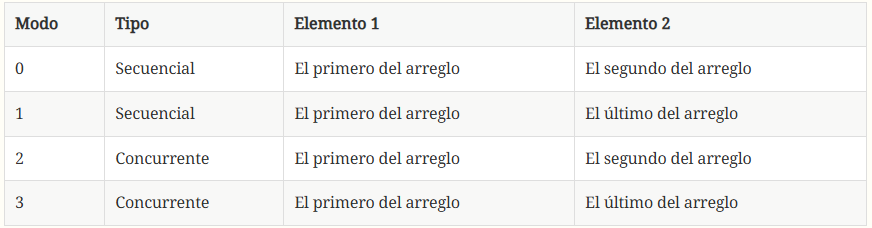

# Enunciado

Estudie y ejecute el programa dado en sus cuatro modos, usando los argumentos de línea de comandos 0 a 3. Todos los modos realizan la misma tarea de actualizar dos elementos de un arreglo cien millones de veces. En los modos 0 y 1 los dos elementos se actualizan de forma serial. En los modos 2 y 3 dos hilos concurrentemente actualizan los elementos, como se muestra en la siguiente tabla.

Se espera que las versiones seriales tarden aproximadamente lo mismo y que las versiones concurrentes tarden aproximadamente la mitad de las versiones seriales. Sin embargo, esto no ocurre. Trate de explicar por qué.

## Explicación de por qué se tarda más o menos dependiendo de la versión

El último modo es el más rápido debido al término conocido como "coherencia de caché"

Según la página <https://techinfo.wiki/coherencia-de-cache/#:~:text=Definici%C3%B3n%3A%20%C2%BFQu%C3%A9%20significa%20Coherencia%20de%20cach%C3%A9%3F%20La%20coherencia,o%20los%20sistemas%20de%20memoria%20compartida%20distribuida%20%28DSM%29>

La coherencia de la caché es la regularidad o consistencia de los datos almacenados en la memoria caché. Mantener la consistencia de la memoria caché y la memoria es imperativo para los multiprocesadores o los sistemas de memoria compartida distribuida (DSM).

Tomando en cuenta lo anterior: Cuando dos hilos actualizan elementos que están muy cerca en memoria (como en run_concurrent(FIRST_ELEMENT, SECOND_ELEMENT)), pueden competir por las mismas líneas de caché, lo que se conoce como "false sharing". Esto puede realentizar el rendimiento. Basicamente lo que pasa es que ocurre un "fallo de caché" lo que pasa es que el caché L1 está esperando a la posición de ese arreglo digamos que es la posición 0, este elemento no está en ese caché, por lo que el CPU debe esperar a que el elemento se consiga en el caché L2 y si no está allí, debe de ir a la RAM para conseguir ese elemento, lo que obviamente realentiza el tiempo de ejecución. Aunque no hayan condiciones de carrera los hilos al estar muy cerca (en las posiciones del arreglo), uno le está invalidando el caché al otro haciendo que tenga que ir a hacer el proceso descrito como fallo de caché. Esto tiene el mismo efecto de un mutex, lo que se llama "false sharing".

En run_concurrent(FIRST_ELEMENT, LAST_ELEMENT), los elementos están más separados, lo que reduce la contención de caché y mejora el rendimiento, porque un hilo no está invalidando el caché del otro.

Al actualizar elementos que están más separados, los hilos pueden trabajar de manera más independiente, lo que puede llevar a una mejor utilización de los recursos de la CPU y una menor interferencia entre los hilos.
