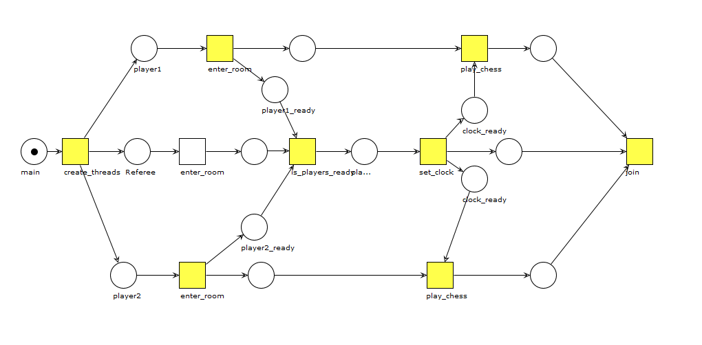

# Enunciado

En un torneo de ajedrez los participantes efectúan el siguiente itinerario tradicional. Los jugadores y árbitros se identifican para ingresar al centro deportivo (enter_room). Cada jugador ubica la mesa con su tablero y se sienta en ella. Una vez que ambos jugadores están presentes, avisan al árbitro. El árbitro establece el tiempo en el reloj (set_clock) del tablero y con ello ambos jugadores inician la partida (play_chess).

El problema se considera resuelto si el árbitro establece el reloj sólo hasta que los dos jugadores hayan ingresado al centro deportivo (enter_room) y los jugadores juegan (play_chess) hasta que el árbitro haya establecido el reloj (set_clock). Considere el siguiente código inicial que trata de representar el escenario descrito.

Agregue control de concurrencia al código inicial para considerando todas las posibles rutas de ejecución, el problema siempre esté resuelto.

## IMPORTANTE

El profesor nos indicó que solamente hicieramos el diagrama de petri para éste código, se usó la apliación WoPeD para ello. Por lo que lo podrá abrir ahí y ver la simulación de una forma más amigable.

## Diagrama de petri

Note que se pusieron dos clock_ready, pero estos son el mismo, es solamente para que la simulación en el programa pudiera seguir su curso normal.

