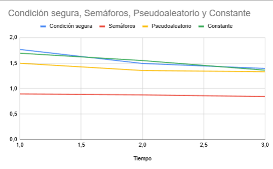

# Enunciado

Trabajo de Sebastián Orozco Castillo y Diego Cerdas Delgado

Ejecute al menos tres veces los códigos de Ejemplo 7 (imprimir en orden con semáforos) y Ejemplo 8 (imprimir en orden con seguridad condicional) con tantos hilos como su sistema operativo permite.

Anote las tres duraciones de cada solución. Tome la mayor duración de las tres corridas de cada versión. Agregue los resultados a sus cuadros y gráficos del Ejercicio 14 [delayed_busy_wait].

Si en un proyecto con sus clientes usted tuviere que implementar una de las cuatro soluciones para hacer un trabajo en orden ¿Cuál solución escogería? Agregue además un párrafo a la discusión de Ejercicio 14 [delayed_busy_wait] explicando la potencial causa de este comportamiento.

## Duraciones del ejemplo 7

1. Tiempo 1: 0.895485400
1. Tiempo 2: 0.876772600
1. Tiempo 3: 0.844265000

## Duraciones del ejemplo 8

1. Tiempo 1: 1.767811900
1. Tiempo 2: 1.493220700
1. Tiempo 3: 1.395148000

## Duraciones del ejemplo delayed_busy_wait tiempo constante

1. Tiempo 1: 1.694622100
1. Tiempo 2: 1.550308700
1. Timepo 3: 1.360802800

## Duraciones del ejemplo delayed_busy_wait tiempo pseudoaleatorio

1. Tiempo 1: 1.497360700
1. Tiempo 2: 1.354566400
1. Tiempo 3: 1.330442700

## Tabla de tiempos

| Tiempo | Condición segura | Semáforos | Pseudoaleatorio | Constante |
|--------|------------------|-----------|-----------------|-----------|
| 1      | 1,7678119        | 0,8954854 | 1,4973607       | 1,6946221 |
| 2      | 1,4932207        | 0,8767726 | 1,3545664       | 1,5503087 |
| 3      | 1,395148         | 0,844265  | 1,3304427       | 1,3608028 |

## Gráfico de la tabla de tiempos

## Discusión

Después de haber analizado estos datos, consideramos que, en un entorno laboral, la decisión más adecuada sería implementar semáforos. Esto se debe a que, como se observa en la tabla de resultados, la implementación de semáforos mostró los mejores tiempos de ejecución. Al buscar la opción más óptima y eficiente para el trabajo, dentro de las cuatro alternativas analizadas, los semáforos destacan como la solución ideal para la realización de tareas.

Por otro lado, la espera activa sería completamente descartada debido al derroche de recursos que conlleva. Este enfoque provoca un aumento innecesario del overhead total, ya que los hilos consumen recursos constantemente mientras esperan, en lugar de liberarlos. Esto no solo reduce la eficiencia del sistema, sino que también podría llevar a problemas de rendimiento en escenarios de alta carga.

Una herramienta adicional que podría ser útil, dependiendo del contexto, sería el uso de condiciones seguras (condition variables). Estas permiten garantizar que ningún hilo acceda a la misma sección de memoria simultáneamente, sincronizando adecuadamente los hilos y asegurando que el acceso a los recursos compartidos se realice de forma ordenada y eficiente. De esta manera, se evitarían colisiones o inconsistencias en la manipulación de datos, manteniendo la integridad y el rendimiento del sistema.
