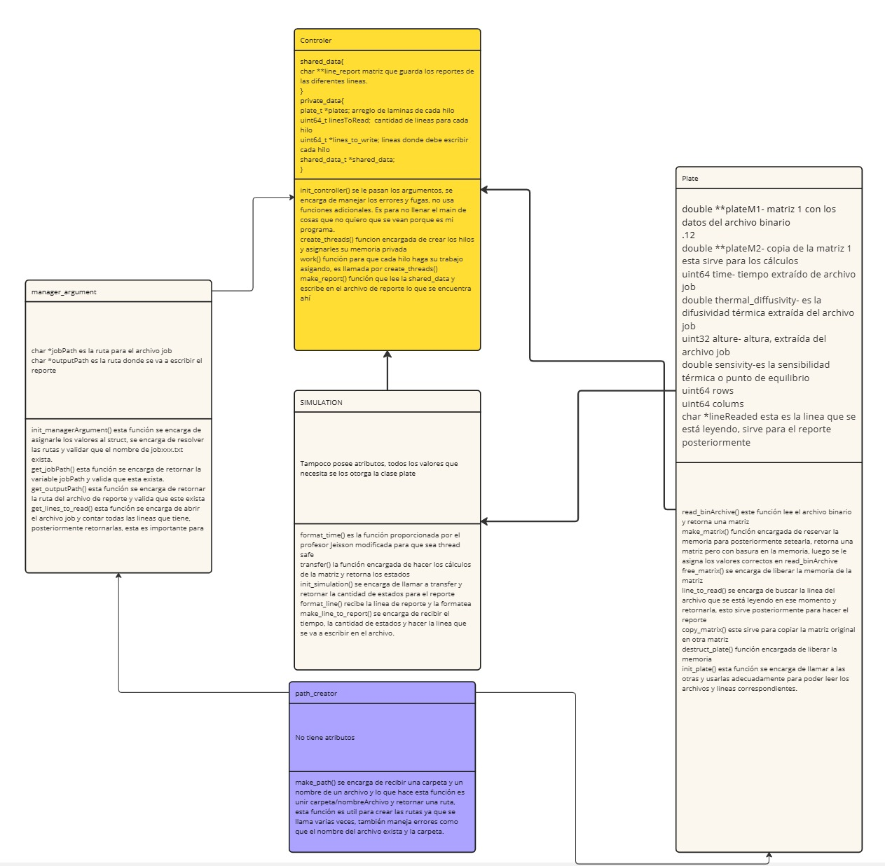
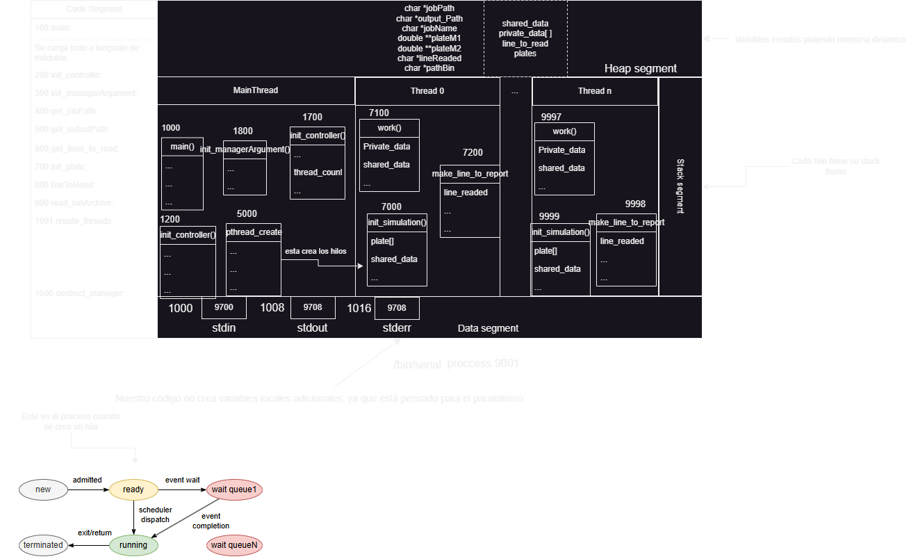

# Design of solution

Table of Contents

## Object-oriented design

Para la solución orientada a objetos se implementó el siguiente diagrama UML, el cual describe todos los objetos controladores, y como están correlacionados entre ellos.



(mejor ver imágen y hacer zoom para leer porque quedó un poco pequeño)

## Procedural design

A continuación se van a dejar todos los diseños de pseudocódigo que se hicieron, los diseños de pseudocódigos abarcan todo el código del programa.

Por razones de espacio y legibilidad, solo se van a dejar las funciones que inicializan de cada pseudo, pero se dejará la ruta por si se desea ver más a profundidad cada pseudo que se hizo.

[path_creator.pseudo](path_creator.pseudo)

``` pseudo
procedure make_path(subdirectory, nameArchive)
  // Validar si subdirectory es nulo
  if subdirectory is null then
    print "Error: subdirectory is null"
    return NULL
  end if

  // Validar si nameArchive es nulo
  if nameArchive is null then
    print "Error: nameArchive is null"
    return NULL
  end if

  // Calcular la longitud de subdirectory
  declare length1 as size_t := 0
  while subdirectory[length1] != '\0' do
    length1 := length1 + 1
  end while

  // Calcular la longitud de nameArchive
  declare length2 as size_t := 0
  while nameArchive[length2] != '\0' do
    length2 := length2 + 1
  end while
  length2 := length2 + 2

  // Asignar memoria para path
  declare path as string := allocate memory of (length1 + length2)
  if path is null then
    print "Error: can't assign memory correctly"
    return NULL
  end if

  // Construir el path
  declare j as size_t := 0
  for i := 0 to length of subdirectory do
    path[j] := subdirectory[i]
    j := j + 1
  end for
  path[j] := '/'
  j := j + 1
  for i := 0 to length of nameArchive do
    path[j] := nameArchive[i]
    j := j + 1
  end for
  path[j] := '\0'

  print path
  return path
end procedure

```

[manager_argument.pseudo](manager_argument.pseudo)

``` pseudo
procedure init_managerArgument(manager, argv[])
  path_job := make_path(argv[2], argv[1])
  jobName := extract_outputName(argv[1])
  path_output := make_path(argv[3], jobName)
  manager.jobPath := path_job
  manager.outputPath := path_output

  thread_count := sysconf(_SC_NPROCESSORS_ONLN)
  if sscanf(argv[4], "%" SCNu64, &thread_count) is 1 then
    manager.thread_count := thread_count
  else
    print "Error: invalid thread count"
    free jobName
    return
  end if

  if thread_count is 0 then
    manager.thread_count := sysconf(_SC_NPROCESSORS_ONLN)
  end if

  free jobName
end procedure
```

[plate.pseudo](plate.pseudo)

``` pseudo
procedure init_plate(plate, jobFilePath, subBin, line)
  declare Time, Thermal_diffusivity, Alture, Sensitivity
  file := open_file(jobFilePath, "r")
  if file is NULL then
    print "Error: can't open the file"
    close_file(file)
    return 2
  end if

  line_readed := lineToRead(file, line)
  if line_readed is NULL then
    plate.blankline := 1
    close_file(file)
    return 1
  end if

  index := 0
  while line_readed[index] is not ' ' do
    index := index + 1
  end while
  index := index + 1

  BinaryFile := allocate memory for string of size index

  if sscanf(line_readed, "%s %" SCNd64 " %le %" SCNd32 " %le", BinaryFile, &Time, &Thermal_diffusivity, &Alture, &Sensitivity) is 5 then
    plate.plateM1 := read_binArchive(plate, BinaryFile, subBin)
    plate.plateM2 := copy_matrix(plate.rows, plate.columns, plate.plateM1)
    plate.time := Time
    plate.thermal_diffusivity := Thermal_diffusivity
    plate.alture := Alture
    plate.sensitivity := Sensitivity
    plate.lineReaded := line_readed
    plate.blankline := 0
  else
    print "Error: the values of jobFile are incorrect"
    free BinaryFile
    close_file(file)
    return 2
  end if

  free BinaryFile
  close_file(file)
  return 0
end procedure
```

[simulation.pseudo](simulation.pseudo)

``` pseudo
procedure init_simulation(plate)
  declare formula as double := (plate.time * plate.thermal_diffusivity) / (plate.alture * plate.alture)
  declare plate_matrix1 as double[][] := plate.plateM1
  declare plate_matrix2 as double[][] := plate.plateM2
  if plate_matrix1 is NULL and plate_matrix2 is NULL then
    return 0
  end if
  declare R as uint64_t := plate.rows
  declare C as uint64_t := plate.columns
  declare point as double := plate.sensitivity
  declare states as uint64_t := transfer(plate_matrix1, plate_matrix2, formula, R, C, point)
  if states is 0 then
    print "Error: can't make the simulation"
    return 0
  end if
  return states
end procedure
```

[main.pseudo](main.pseudo)

``` pseudo
procedure main(argc, argv[])
  // Valida el número de argumentos
  if argc = 5 then
    print "Welcome"
    // comienza la simulación
    call init_controller(argv)
  else if argc <= 4 then
    print "Error: this program needs four arguments to work no less"
    return 1
  else if argc > 4 then
    print "Error: this program needs four arguments no more"
    return 2
  end if
  return 0
end procedure
```

[controller.pseudo](controller.pseudo)

``` pseudo
procedure init_controller(argc, argv[])
  initialize manager_argument with init_managerArgument(argv)
  jobPath := get_jobPath(manager_argument)
  output_Path := get_outputPath(manager_argument)
  thread_count := manager_argument.thread_count

  if jobPath is NULL or output_Path is NULL then
    call destruct_manager(manager_argument)
    return
  end if

  linesToRead := get_lines_to_read(jobPath)
  if linesToRead is 0 then
    call destruct_manager(manager_argument)
    return
  end if

  shared_data := allocate memory for shared_data_t
  shared_data.line_report := allocate memory for array of linesToRead texts

  plates := array of linesToRead plates
  for i from 0 to linesToRead - 1 do
    call init_plate(plates[i], jobPath, argv[2], i)
  end for

  if thread_count is 1 then
    for i from 0 to linesToRead - 1 do
      if plates[i].blankline is 0 then
        states := init_simulation(plates[i])
        line := make_line_to_report(plates[i].lineReaded, plates[i].time * states, states)
        shared_data.line_report[i] := line
        print "Plate number: " + i + " calculated correctly..."
      end if
    end for
  else
    call create_threads(thread_count, plates, linesToRead, shared_data)
  end if

  error := make_report(shared_data.line_report, output_Path, linesToRead)
  if error is 0 then
    print "The report was created successfully"
    for i from 0 to linesToRead - 1 do
      if shared_data.line_report[i] is not NULL then
        print shared_data.line_report[i]
      end if
    end for
  end if

  for i from 0 to linesToRead - 1 do
    if plates[i].blankline is 0 then
      call destruct_plate(plates[i])
    end if
  end for

  for i from 0 to linesToRead - 1 do
    if shared_data.line_report[i] is not NULL then
      free shared_data.line_report[i]
    end if
  end for

  free shared_data.line_report
  free shared_data
  call destruct_manager(manager_argument)
end procedure
```

## Memory Diagram

Este es un diagrama de como se vería la memoria, no se quiere hacer exacto, pues sería muy difícil ya que en tiempo de compilación el tamaño de muchas variables es asignado, entonces depende de la arquitectura de la computadora donde se esté corriendo incluso, la cantidad de hilos y trabajo para cada hilo es asignado en tiempo de compilación.

Cabe recalcar que el diagrama no es exacto, simplemente es una represente una aproximación a como se está usando la memoria, se tomó de referencia el de la página de jeisson simplemente se adapto a este trabajo. Recordar que la cantidad de hilos es pasada por el argumento, por lo que hay n threads en el stack, esto es simplemente representativo ya que cada hilo ocupa un stack frame.


