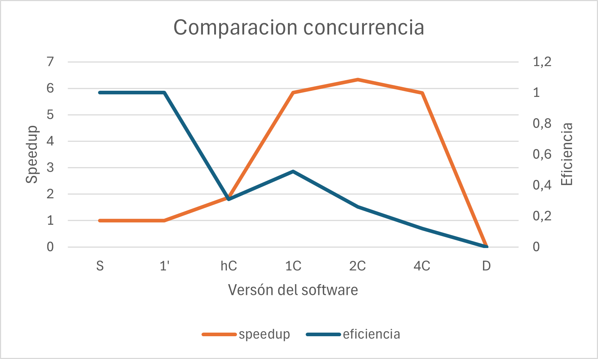

= Reporte de optimizaciones
:experimental:
:nofooter:
:source-highlighter: pygments
:sectnums:
:stem: latexmath
:toc:
:xrefstyle: short

[[concurrency_comparison]]
=== Comparación del grado de concurrencia

Este va a ser el reporte de la tarea04 como no se pidio ni se dió un formato en específico y solo se pidió comparaciones del grado de concurrencia, no se van a usar tantas tablas como la tarea pasada.

Pthreads:

[%autowidth.stretch,options="header"]
|===
|# |Etiqueta |Descripción |Hilos |speedup |eficiencia| Tiempo
|1 |S |Versión serial final |1 |1.00 |1.00 | 9812.5760090000
|2 |1 |Un solo hilo(El concurrente si es solo un hilo se ejecuta serial, el programa tiene la capacidad de decidir esto) |1 |1.00 |1.00 |9812.5760090000
|3 |hC |Tantos hilos como la mitad de CPUs hay en la computadora que ejecuta el programa |6 |1.87 |0.31 |5251.3257101438
|4 |1C |Tantos hilos por cada CPU que hay en la computadora que ejecuta el programa |12 |5.84 |0.49 |1680.4242272460
|5 |2C |Dos hilos por cada CPU que hay en la computadora que ejecuta el programa |24 |6.33 |0.26 |1549.2387122400
|6 |4C |Cuatro hilos por cada CPU que hay en la computadora que ejecuta el programa |48 |5.82 |0.12 |1685.2469874119
|7 |D |Tantos hilos como unidades de descomposición hay en la entrada (en caso de que sea menor que la cantidad máxima de hilos permitida por el sistema operativo) |D en este caso el sistema permite 63690 hilos|No tiene es negativo |No tiene |Tarda mucho, no vale la pena calcular
|===

Primeramente, la versión serial sirve como referencia base para comparar las versiones concurrentes. Tiene un speedup y eficiencia de 1.00, ya que no se beneficia de la concurrencia.

Versión con un hilo (1):

Similar a la versión serial, esta versión no muestra mejoras en el rendimiento ya que se ejecuta de manera serial.

Mitad de CPUs (hC):

Utilizando la mitad de los CPUs disponibles, esta versión muestra una mejora significativa en el tiempo de ejecución, aunque la eficiencia es relativamente baja.

Un hilo por CPU (1C):

Esta versión muestra un notable incremento en el speedup y una eficiencia razonable, logrando un tiempo de ejecución significativamente menor

Dos hilos por CPU (2C):

Aunque el speedup es ligeramente mayor que en la versión 1C, la eficiencia disminuye considerablemente, lo que indica una sobrecarga de gestión de hilos.

Cuatro hilos por CPU (4C):

Esta versión muestra una disminución en el speedup y una eficiencia muy baja, lo que muestra el gráfico y las pruebas que el incremento en el número de hilos no se traduce en mejoras de rendimiento.

Unidades de descomposición (D):

Utilizar un número excesivo de hilos resulta en un rendimiento negativo debido a la sobrecarga de gestión de hilos y la competencia por recursos.

Cantidad Óptima de Hilos:

A partir de los resultados y el gráfico, la cantidad óptima de hilos para conseguir el mejor rendimiento es 12 hilos (1C). Esta configuración logra un balance adecuado entre el incremento de velocidad y la eficiencia. Aunque la versión con 24 hilos (2C) tiene un speedup ligeramente mayor, la eficiencia disminuye significativamente, lo que indica una sobrecarga de gestión de hilos. Por lo tanto, 12 hilos proporcionan el mejor rendimiento en términos de tiempo de ejecución y eficiencia.
Además la computadora donde se probó contiene 6 nucleos y 12 hilos, por lo que estas especificaciones sugieren que 12 hilos debería ser la cantidad óptima. Aunque se puedan conseguir mejores tiempos con más hilos.

Conclusión:

El análisis de los resultados muestra que la versión con 12 hilos (1C) es la más eficiente (según la fórmula, no se prueba en memoria) y proporciona el mejor rendimiento general (según la muestra). Incrementar el número de hilos más allá de este punto no resulta en mejoras significativas y, de hecho, puede disminuir la eficiencia debido a la sobrecarga de gestión de hilos.

Esta es una continuación de esta tarea, se van a usar los mismos datos, por lo que se dejan las demas cosas intactas y se continua desde aca.

Openmp: 

[%autowidth.stretch,options="header"]
|===
|# |Etiqueta |Descripción |Hilos |speedup |eficiencia| Tiempo
|1 |S |Versión serial final |1 |1.00 |1.00 | 9812.5760090000
|2 |1 |Un solo hilo(El concurrente si es solo un hilo se ejecuta serial, el programa tiene la capacidad de decidir esto) |1 |1.00 |1.00 |9812.5760090000
|3 |hC |Tantos hilos como la mitad de CPUs hay en la computadora que ejecuta el programa |6 |1.87 |0.31 |5251.3257101438
|4 |1C |Tantos hilos por cada CPU que hay en la computadora que ejecuta el programa |12 |5.84 |0.49 |1680.4242272460
|5 |2C |Dos hilos por cada CPU que hay en la computadora que ejecuta el programa |24 |6.33 |0.26 |1549.2387122400
|6 |4C |Cuatro hilos por cada CPU que hay en la computadora que ejecuta el programa |48 |5.82 |0.12 |1685.2469874119
|7 |D |Tantos hilos como unidades de descomposición hay en la entrada (en caso de que sea menor que la cantidad máxima de hilos permitida por el sistema operativo) |D en este caso el sistema permite 63690 hilos|No tiene es negativo |No tiene |Tarda mucho, no vale la pena calcular
|===

OpenMPI:

[%autowidth.stretch,options="header"]
|===
|# |Etiqueta |Descripción |Hilos |speedup |eficiencia| Tiempo
|1 |S |Versión serial final |1 |1.00 |1.00 | 9812.5760090000
|2 |1 |Un solo hilo(El concurrente si es solo un hilo se ejecuta serial, el programa tiene la capacidad de decidir esto) |1 |1.00 |1.00 |9812.5760090000
|3 |hC |Tantos hilos como la mitad de CPUs hay en la computadora que ejecuta el programa |6 |1.87 |0.31 |5251.3257101438
|4 |1C |Tantos hilos por cada CPU que hay en la computadora que ejecuta el programa |12 |5.84 |0.49 |1680.4242272460
|5 |2C |Dos hilos por cada CPU que hay en la computadora que ejecuta el programa |24 |6.33 |0.26 |1549.2387122400
|6 |4C |Cuatro hilos por cada CPU que hay en la computadora que ejecuta el programa |48 |5.82 |0.12 |1685.2469874119
|7 |D |Tantos hilos como unidades de descomposición hay en la entrada (en caso de que sea menor que la cantidad máxima de hilos permitida por el sistema operativo) |D en este caso el sistema permite 63690 hilos|No tiene es negativo |No tiene |Tarda mucho, no vale la pena calcular
|===
