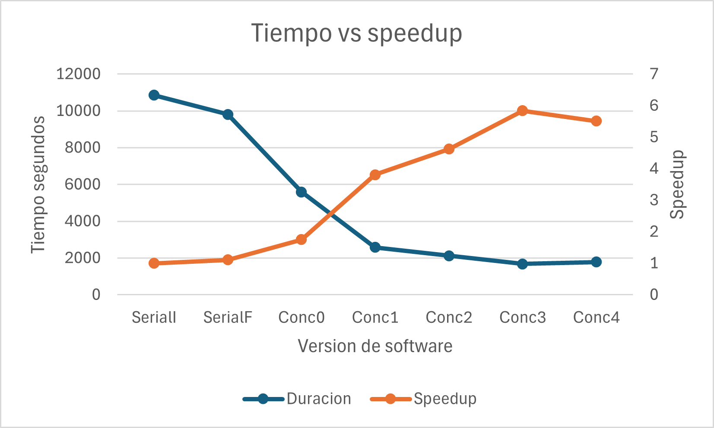
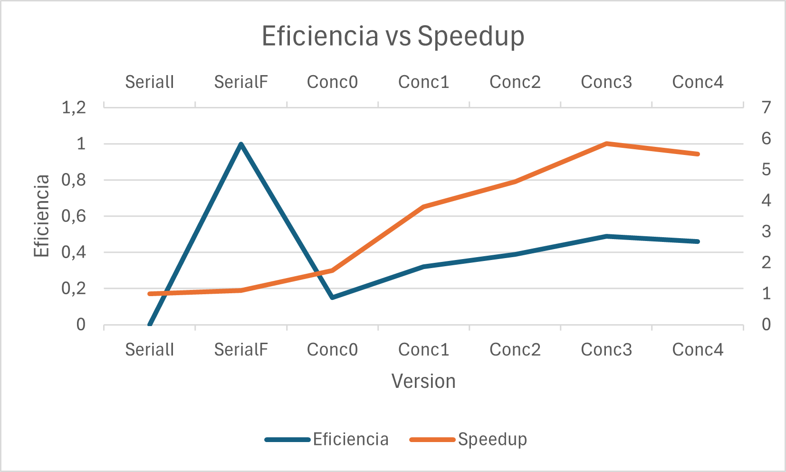
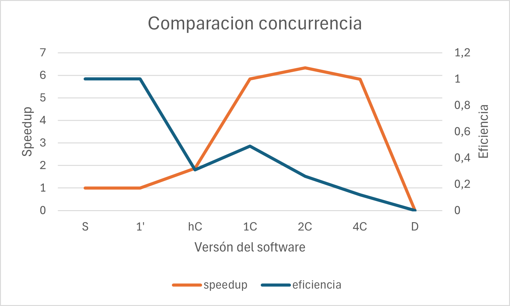

= Reporte de optimizaciones
:experimental:
:nofooter:
:source-highlighter: pygments
:sectnums:
:stem: latexmath
:toc:
:xrefstyle: short

[[serial_optimizations]]
== Optimizaciones seriales

[%autowidth.stretch,options="header"]
|===
|Iter. |Etiqueta |Duración (s) |_Speedup_ |Descripción corta
|0 |Serial0 |10851.628528535 |1.00 |Versión serial inicial (Tarea01)
|1 |Serial1 |9812.5760090000 |1.11 |Versión serial creación de arreglos y copias de memoria directas (Tarea03)
|===

[[serial_iter00]]
=== Versión serial original (Tarea01)

image::images/serial001.png[Versión sin modificaciones]

Esta es la imagen de la versión serial sin optimizar. Como se puede ver, el aspecto menos eficiente es a la hora de copiar las matrices y acceder a los elementos de la matriz. Además, cuando finaliza el ciclo, hace una copia de más que es innecesaria, ya que no se va a usar para nada y se pierde tiempo en ella. Sin embargo, esta versión tenía algo bueno: no itera sobre los bordes de la matriz, ya que estos serían un cálculo innecesario. Esto se mantuvo.

[[serial_iter01]]
=== Iteración 1

En esta optimización realmente son dos en una. Cuando se aplastan las matrices en un arreglo, esto permite copiar la memoria rápidamente y mejora el acceso al caché, ya que no produce tantos fallos de caché. También en esta optimización se permitió ganar tiempo a la hora de copiar una matriz a otra y recorrer la matriz. Se adjuntará ese código como uno ya que están dentro del mismo bloque.

image::images/serial002.png[Serial002]

Como se puede ver, mejoraron los puntos críticos que mostraba kcachegrind.

[source,c]
----
double *arrayToMatrix(double **matrix, uint64_t R, uint64_t C) {
  double *array = (double *)malloc(R * C * sizeof(double));
  if (!array) {
    fprintf(stderr,"Error: can't make the array\n");
    return NULL;
  }
  /// situar todos los valores de la matriz en el arreglo
  for (uint64_t i = 0; i < R; i++) {
    for (uint64_t j = 0; j < C; j++) {
      array[i * C + j] = matrix[i][j];
    }
  }
  return array;
}
----

[source,c]
----
for (uint64_t i = 1; i < R - 1; i++) {
  uint64_t base_idx = i * C;
  for (uint64_t j = 1; j < C - 1; j++) {
    uint64_t idx = base_idx + j;
    up = matrix2[idx - C];
    down = matrix2[idx + C];
    left = matrix2[idx - 1];
    right = matrix2[idx + 1];
    center = matrix2[idx];
    matrix1[idx] =
        center + formula * (up + right + down + left - 4 * center);
    if (fabs(matrix1[idx] - center) > point) {
      limit = true;
    }
  }
}
// To update the matrix
if (limit) {
  double *temp = matrix2;
  matrix2 = matrix1;
  matrix1 = temp;
}
----

[[concurrent_optimizations]]
== Optimizaciones concurrentes

[%autowidth.stretch,options="header"]
|===
|Iter. |Etiqueta |Duración (s) |_Speedup_ |Eficiencia |Descripción corta
|- |SerialI |9812.5760090000 |1.00 |1.00 |Versión serial final
|0 |Conc0 |5589.1285985670 |1.75 |0.15 |Versión concurrente inicial (Tarea02)
|1 |Conc1 |2578.5239965700 |3.81 |0.32 |Versión concurrente con las optimizaciones de la serial final, nada concurrente, pero cuenta ya que con hilos agiliza el tiempo
|2 |Conc2 |2124.5898104180 |4.62 |0.39 |Versión concurrente, implementando hilos en los cálculos
|3 |Conc3 |1680.4242272460 |5.84 |0.49 |Versión concurrente final, implementando barrera y quitando pthread_join y añadiendo decisión para matrices grandes mapeo estático
|4 |Conc4 |1781.8798552150 |5.51 |0.46 |Versión concurrente final, implementando barrera y quitando pthread_join y añadiendo decisión para matrices grandes mapeo dinámico
|===

[[conc_iter00]]
=== Versión concurrente inicial (Tarea02)

Tenía las mismas deficiencias que la tarea01, ya que el código por parte de los cálculos no se modificó. La paralelización fue hecha fuera de los cálculos.

[[conc_iter01]]
=== Iteración 1

Al optimizarse la tarea serial, esta también mejoró muchísimo el tiempo. Se puede ver que con optimizar la serial se redujo muchísimo el tiempo de esta.

[[conc_iter02]]
=== Iteración 2

Se implementó la división de la matriz para realizar los cálculos más rápido, lo que dio muy buenos resultados para matrices grandes, pero para matrices pequeñas era muy lento y tardaba.

[[conc_iter03]]
=== Iteración 3

Acá se implementaron barreras y se controló mejor la concurrencia, lo que dio los mejores resultados. Además, se añadió una decisión para cuando las matrices son muy pequeñas se hagan de manera serial con mapeo estático.

[[conc_iter04]]
=== Iteración 4

Acá se implementaron barreras y se controló mejor la concurrencia, lo que dio los mejores resultados. Además, se añadió una decisión para cuando las matrices son muy pequeñas se hagan de manera serial con mapeo dinámico. No es la version final ya que presentó tiempos peores que la concurrente con mapeo stático

[[optimization_comparison]]
=== Comparación de optimizaciones

Se adjuntan los gráficos con los tiempos de las tablas anteriormente comentadas y optimizaciones explicadas.

Los nombres son significativos para que se entienda que se estaba comparando.

Versión Serial Inicial (Serial0):

La versión serial inicial tiene el mayor tiempo de ejecución, lo cual era esperado debido a la falta de optimizaciones.

Primera Optimización Serial (Serial1):

La primera optimización serial muestra una mejora significativa en el tiempo de ejecución. Esto se debe a la optimización en la creación de arreglos y copias de memoria directas, lo que reduce el tiempo de acceso a la memoria y mejora la eficiencia del caché.

Versión Concurrente Inicial (Conc0):

La versión concurrente inicial muestra una mejora en el tiempo de ejecución en comparación con la versión serial final. Sin embargo, la eficiencia es baja debido a la sobrecarga de la creación y sincronización de hilos.

Optimización Concurrente con Mejoras Seriales (Conc1):

Al aplicar las optimizaciones de la versión serial final a la versión concurrente, se observa una mejora significativa en el tiempo de ejecución. Esto demuestra que las optimizaciones seriales también benefician a la versión concurrente.

Implementación de Hilos en los Cálculos (Conc2):

La implementación de hilos en los cálculos muestra una mejora adicional en el tiempo de ejecución. Esto se debe a la paralelización efectiva de los cálculos, lo que reduce el tiempo total de ejecución.

Versión Concurrente con Barreras y Mapeo Estático (Conc3):

La versión concurrente con barreras y mapeo estático muestra una mejora significativa en el tiempo de ejecución. La utilización de barreras mejora la sincronización entre los hilos, y el mapeo estático asegura una distribución equilibrada de la carga de trabajo.

Versión Concurrente con Barreras y Mapeo Dinámico (Conc4):

La versión concurrente con barreras y mapeo dinámico muestra un tiempo de ejecución ligeramente peor que la versión con mapeo estático. Esto puede deberse a la sobrecarga adicional de la asignación dinámica de tareas, que puede no ser tan eficiente como el mapeo estático en este caso.

El segundo gráfico muestra la comparación del speedup y la eficiencia para las diferentes versiones del código. A continuación, se discuten las observaciones clave:

Speedup:

El speedup aumenta significativamente con cada optimización concurrente. La versión concurrente con barreras y mapeo estático (Conc3) muestra el mayor speedup, lo que indica una mejora significativa en el rendimiento en comparación con la versión serial.
La versión concurrente con mapeo dinámico (Conc4) muestra un speedup ligeramente menor que la versión con mapeo estático, lo que sugiere que el mapeo dinámico puede no ser tan eficiente en este caso.
Eficiencia:

La eficiencia es baja en la versión concurrente inicial (Conc0) debido a la sobrecarga de la creación y sincronización de hilos.

La eficiencia mejora con cada optimización concurrente, alcanzando su punto máximo en la versión con barreras y mapeo estático (Conc3).

La eficiencia de la versión con mapeo dinámico (Conc4) es ligeramente menor que la de la versión con mapeo estático, lo que sugiere que la sobrecarga adicional de la asignación dinámica de tareas puede afectar negativamente la eficiencia.

[[concurrency_comparison]]
=== Comparación del grado de concurrencia

[%autowidth.stretch,options="header"]
|===
|# |Etiqueta |Descripción |Hilos |speedup |eficiencia| Tiempo
|1 |S |Versión serial final |1 |1.00 |1.00 | 9812.5760090000
|2 |1 |Un solo hilo(El concurrente si es solo un hilo se ejecuta serial, el programa tiene la capacidad de decidir esto) |1 |1.00 |1.00 |9812.5760090000
|3 |hC |Tantos hilos como la mitad de CPUs hay en la computadora que ejecuta el programa |6 |1.87 |0.31 |5251.3257101438
|4 |1C |Tantos hilos por cada CPU que hay en la computadora que ejecuta el programa |12 |5.84 |0.49 |1680.4242272460
|5 |2C |Dos hilos por cada CPU que hay en la computadora que ejecuta el programa |24 |6.33 |0.26 |1549.2387122400
|6 |4C |Cuatro hilos por cada CPU que hay en la computadora que ejecuta el programa |48 |5.82 |0.12 |1685.2469874119
|7 |D |Tantos hilos como unidades de descomposición hay en la entrada (en caso de que sea menor que la cantidad máxima de hilos permitida por el sistema operativo) |D en este caso el sistema permite 63690 hilos|No tiene es negativo |No tiene |Tarda mucho, no vale la pena calcular
|===

Primeramente, la versión serial sirve como referencia base para comparar las versiones concurrentes. Tiene un speedup y eficiencia de 1.00, ya que no se beneficia de la concurrencia.

Versión con un hilo (1):

Similar a la versión serial, esta versión no muestra mejoras en el rendimiento ya que se ejecuta de manera serial.

Mitad de CPUs (hC):

Utilizando la mitad de los CPUs disponibles, esta versión muestra una mejora significativa en el tiempo de ejecución, aunque la eficiencia es relativamente baja.

Un hilo por CPU (1C):

Esta versión muestra un notable incremento en el speedup y una eficiencia razonable, logrando un tiempo de ejecución significativamente menor

Dos hilos por CPU (2C):

Aunque el speedup es ligeramente mayor que en la versión 1C, la eficiencia disminuye considerablemente, lo que indica una sobrecarga de gestión de hilos.

Cuatro hilos por CPU (4C):

Esta versión muestra una disminución en el speedup y una eficiencia muy baja, lo que muestra el gráfico y las pruebas que el incremento en el número de hilos no se traduce en mejoras de rendimiento.

Unidades de descomposición (D):

Utilizar un número excesivo de hilos resulta en un rendimiento negativo debido a la sobrecarga de gestión de hilos y la competencia por recursos.

Cantidad Óptima de Hilos:

A partir de los resultados y el gráfico, la cantidad óptima de hilos para conseguir el mejor rendimiento es 12 hilos (1C). Esta configuración logra un balance adecuado entre el incremento de velocidad y la eficiencia. Aunque la versión con 24 hilos (2C) tiene un speedup ligeramente mayor, la eficiencia disminuye significativamente, lo que indica una sobrecarga de gestión de hilos. Por lo tanto, 12 hilos proporcionan el mejor rendimiento en términos de tiempo de ejecución y eficiencia.
Además la computadora donde se probó contiene 6 nucleos y 12 hilos, por lo que estas especificaciones sugieren que 12 hilos debería ser la cantidad óptima. Aunque se puedan conseguir mejores tiempos con más hilos.

Conclusión:

El análisis de los resultados muestra que la versión con 12 hilos (1C) es la más eficiente (según la fórmula, no se prueba en memoria) y proporciona el mejor rendimiento general (según la muestra). Incrementar el número de hilos más allá de este punto no resulta en mejoras significativas y, de hecho, puede disminuir la eficiencia debido a la sobrecarga de gestión de hilos.

(pendiente)