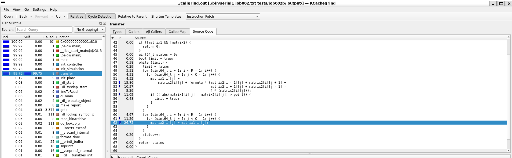
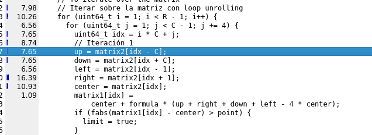

= Reporte de optimizaciones
:experimental:
:nofooter:
:source-highlighter: pygments
:sectnums:
:stem: latexmath
:toc:
:xrefstyle: short

[[serial_optimizations]]
== Optimizaciones seriales

[%autowidth.stretch,options="header"]
|===
|Iter. |Etiqueta |Duración (s) |_Speedup_ |Descripción corta
|0 |Serial0 |10851.628528535 |1.00 |Versión serial inicial (Tarea01)
|1 |Serial1 |9812.5760090000 |1.11 |Versión serial creación de arreglos y copias de memoria directas (Tarea03)
|===

[[serial_iter00]]
=== Versión serial original (Tarea01)

Esta es la imagen de la versión serial sin optimizar. Como se puede ver, el aspecto menos eficiente es a la hora de copiar las matrices y acceder a los elementos de la matriz. Además, cuando finaliza el ciclo, hace una copia de más que es innecesaria, ya que no se va a usar para nada y se pierde tiempo en ella. Sin embargo, esta versión tenía algo bueno: no itera sobre los bordes de la matriz, ya que estos serían un cálculo innecesario. Esto se mantuvo.

[[serial_iter01]]
=== Iteración 1

En esta optimización realmente son dos en una. Cuando se aplastan las matrices en un arreglo, esto permite copiar la memoria rápidamente y mejora el acceso al caché, ya que no produce tantos fallos de caché. También en esta optimización se permitió ganar tiempo a la hora de copiar una matriz a otra y recorrer la matriz. Se adjuntará ese código como uno ya que están dentro del mismo bloque.

Como se puede ver, mejoraron los puntos críticos que mostraba kcachegrind.

[source,c]
----
double *arrayToMatrix(double **matrix, uint64_t R, uint64_t C) {
  double *array = (double *)malloc(R * C * sizeof(double));
  if (!array) {
    fprintf(stderr,"Error: can't make the array\n");
    return NULL;
  }
  /// situar todos los valores de la matriz en el arreglo
  for (uint64_t i = 0; i < R; i++) {
    for (uint64_t j = 0; j < C; j++) {
      array[i * C + j] = matrix[i][j];
    }
  }
  return array;
}
----

[source,c]
----
for (uint64_t i = 1; i < R - 1; i++) {
  uint64_t base_idx = i * C;
  for (uint64_t j = 1; j < C - 1; j++) {
    uint64_t idx = base_idx + j;
    up = matrix2[idx - C];
    down = matrix2[idx + C];
    left = matrix2[idx - 1];
    right = matrix2[idx + 1];
    center = matrix2[idx];
    matrix1[idx] =
        center + formula * (up + right + down + left - 4 * center);
    if (fabs(matrix1[idx] - center) > point) {
      limit = true;
    }
  }
}
// To update the matrix
if (limit) {
  double *temp = matrix2;
  matrix2 = matrix1;
  matrix1 = temp;
}
----

[[concurrent_optimizations]]
== Optimizaciones concurrentes

[%autowidth.stretch,options="header"]
|===
|Iter. |Etiqueta |Duración (s) |_Speedup_ |Eficiencia |Descripción corta
|- |SerialI |9812.5760090000 |1.00 |1.00 |Versión serial final
|1 |Conc0 |5589.1285985670 |1.75 |0.15 |Versión concurrente inicial (Tarea02)
|2 |Conc1 |2578.5239965700 |3.81 |0.32 |Versión concurrente con las optimizaciones de la serial final, nada concurrente, pero cuenta ya que con hilos agiliza el tiempo
|3 |Conc2 |2124.5898104180 |4.62 |0.39 |Versión concurrente, implementando hilos en los cálculos
|4 |Conc3 |1680.4242272460 |5.84 |0.49 |Versión concurrente final, implementando barrera y quitando pthread_join y añadiendo decisión para matrices grandes mapeo estático
|5 |Conc4 |1781.8798552150 |5.51 |0.46 |Versión concurrente final, implementando barrera y quitando pthread_join y añadiendo decisión para matrices grandes mapeo dinámico
|===

[[conc_iter00]]
=== Versión concurrente inicial (Tarea02)

Tenía las mismas deficiencias que la tarea01, ya que el código por parte de los cálculos no se modificó. La paralelización fue hecha fuera de los cálculos.

[[conc_iter01]]
=== Iteración 1

Al optimizarse la tarea serial, esta también mejoró muchísimo el tiempo. Se puede ver que con optimizar la serial se redujo muchísimo el tiempo de esta.

[[conc_iter02]]
=== Iteración 2

Se implementó la división de la matriz para realizar los cálculos más rápido, lo que dio muy buenos resultados para matrices grandes, pero para matrices pequeñas era muy lento y tardaba.

[[conc_iter03]]
=== Iteración 3

Acá se implementaron barreras y se controló mejor la concurrencia, lo que dio los mejores resultados. Además, se añadió una decisión para cuando las matrices son muy pequeñas se hagan de manera serial con mapeo estático.

[[conc_iter04]]
=== Iteración 4

Acá se implementaron barreras y se controló mejor la concurrencia, lo que dio los mejores resultados. Además, se añadió una decisión para cuando las matrices son muy pequeñas se hagan de manera serial con mapeo dinámico.

[[optimization_comparison]]
=== Comparación de optimizaciones

(pendiente)

[[concurrency_comparison]]
=== Comparación del grado de concurrencia

(pendiente)