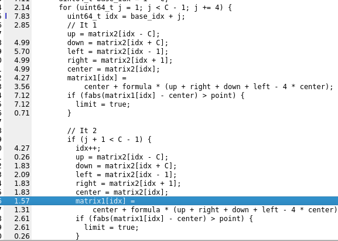

= Reporte de optimizaciones
:experimental:
:nofooter:
:source-highlighter: pygments
:sectnums:
:stem: latexmath
:toc:
:xrefstyle: short

[[serial_optimizations]]
== Optimizaciones seriales

[%autowidth.stretch,options="header"]
|===
|Iter. |Etiqueta |Duración (s) |_Speedup_ |Descripción corta
|0 |Serial0 |10851.628528535 |1.00 |Versión serial inicial (Tarea01)
|1 |Serial1 |9812.5760090000 |1.11 |Versión serial creación de arreglos y copias de memoria directas (Tarea03)

[[serial_iter00]]
=== Versión serial original (Tarea01)

image::images/serial001.png[Versión sin modificaciones]

Esta es la imagen de la versión serial sin optimizar, como se puede ver el aspecto menos eficiente es a la hora de copiar las matrices y a la hora de acceder a los elementos de la matriz, también que cuando finaliza el ciclo hace una copia de más que esta es innecesaria, puesto que no se va a usar para nada y se pierde tiempo en ella.
Sin embargo esta versión tenía algo bueno, no itera sobre los bordes de la matriz, ya que estos serían un cáculo innesario, esto se mantuvo.

[[serial_iter01]]
=== Iteración 1

En esta optimización realmente son dos en una, porque cuando se aplastan las matrices en un arreglo esto permite copiar la memoria rapidamente, además que mejora a la hora de acceder al caché, ya que no produce tantos fallos de caché. También en esta optimización se permitió ganar tiempo a la hora de copiar una matriz a otra y recorrer la matriz, se adjuntará ese código como uno ya que están dentro del mismo bloque.

image::images/serial002.png[Serial002]

Como se puede ver mejoraron los puntos críticos que mostraba kachegrind

[source,c]
----
double *arrayToMatrix(double **matrix, uint64_t R, uint64_t C) {
  double *array = (double *)malloc(R * C * sizeof(double));
  if (!array) {
    fprintf(stderr,"Error: can't make the array\n");
    return NULL;
  }
  /// to situate all values of matrix in the array
  for (uint64_t i = 0; i < R; i++) {
    for (uint64_t j = 0; j < C; j++) {
      array[i * C + j] = matrix[i][j];
    }
  }
  return array;
}
----

[source,c]
----
for (uint64_t i = 1; i < R - 1; i++) {
      uint64_t base_idx = i * C;
      for (uint64_t j = 1; j < C - 1; j++) {
        uint64_t idx = base_idx + j;
        up = matrix2[idx - C];
        down = matrix2[idx + C];
        left = matrix2[idx - 1];
        right = matrix2[idx + 1];
        center = matrix2[idx];
        matrix1[idx] =
            center + formula * (up + right + down + left - 4 * center);
        if (fabs(matrix1[idx] - center) > point) {
          limit = true;
        }
      }
    }
    // To update the matrix
    if (limit) {
      double *temp = matrix2;
      matrix2 = matrix1;
      matrix1 = temp;
    }
----

[[serial_iter02]]
=== Iteración 2
El cambio con respecto a la uno fue simplemente que en el mismo ciclo se hacen más calculos. Sin embargo esto ayudo a mejorar los tiempos un poco. No se muestra el código porque sí quedo un poco más extenso.

Se adjunta la evidencia que esto distribuye mejor las cosas.

[[concurrent_optimizations]]
== Optimizaciones concurrentes

[%autowidth.stretch,options="header"]
|===
|Iter. |Etiqueta |Duración (s) |_Speedup_ |Eficiencia |Descripción corta
|- |SerialI |9812.5760090000 |1.00 |1.00 |Versión serial final
|1 |Conc0 |5589.1285985670 |1.75|0.15 |Versión concurrente inicial (Tarea02)
|2 |Conc1 |2855.7376927230 |3.44|0.29 |Versión concurrente con las optimizaciones de la serial final
|3 | | | | |
|===

[[conc_iter00]]
=== Versión concurrente inicial (Tarea02)

#Describa aquí qué aspectos tenía la versión concurrente (Tarea02) no eficientes que podrían o fueron opitimizados luego. También aspectos que usted considera eficientes, los cuales explicarían por qué no amerita una optimización.#

[[conc_iter01]]
=== Iteración 1

#Para cada iteración del ciclo de optimización, cree una subsección como esta. Resuma en máximo un párrafo en qué consiste la optimización. Su objetivo es que quien lea este documento entienda claramente qué se intentó mejorar. Provea trocitos de código fuente o pseudocódigo que ayude a entender la optimización potencial. Indique si el intento logró incrementar el desempeño. En caso de no lograrlo, conjeture la causa. Eso ayudaría a ahorrar tiempo a otras personas que tengan la misma inquietud.#

[[optimization_comparison]]
=== Comparación de optimizaciones

(pendiente)

[[concurrency_comparison]]
=== Comparación del grado de concurrencia

(pendiente)
