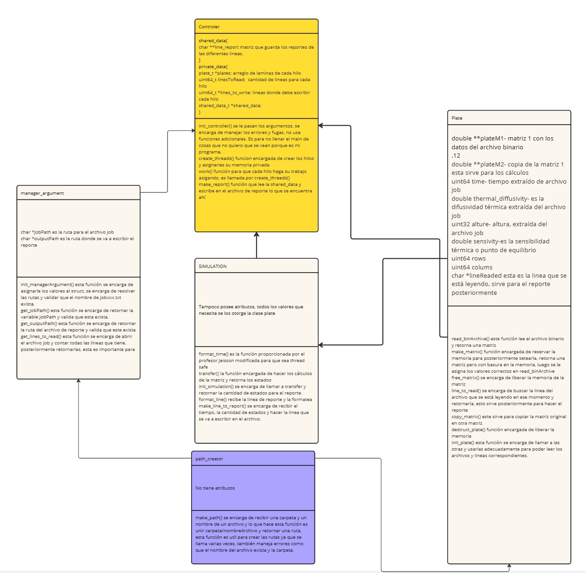

# Design of solution

Table of Contents

## Object-oriented design

Para la solución orientada a objetos se implementó el siguiente diagrama UML, el cual describe todos los objetos controladores, y como están correlacionados entre ellos.



(mejor ver imágen y hacer zoom para leer porque quedó un poco pequeño)

## Procedural design

A continuación se van a dejar todos los diseños de pseudocódigo que se hicieron, los diseños de pseudocódigos abarcan todo el código del programa.

Por razones de espacio y legibilidad, solo se van a dejar las funciones que inicializan de cada pseudo, pero se dejará la ruta por si se desea ver más a profundidad cada pseudo que se hizo.

[path_creator.pseudo](path_creator.pseudo)

``` pseudo
procedure make_path(subdirectory, nameArchive)
  // Validar si subdirectory es nulo
  if subdirectory is null then
    print "Error: subdirectory is null"
    return NULL
  end if

  // Validar si nameArchive es nulo
  if nameArchive is null then
    print "Error: nameArchive is null"
    return NULL
  end if

  // Calcular la longitud de subdirectory
  declare length1 as size_t := 0
  while subdirectory[length1] != '\0' do
    length1 := length1 + 1
  end while

  // Calcular la longitud de nameArchive
  declare length2 as size_t := 0
  while nameArchive[length2] != '\0' do
    length2 := length2 + 1
  end while
  length2 := length2 + 2

  // Asignar memoria para path
  declare path as string := allocate memory of (length1 + length2)
  if path is null then
    print "Error: can't assign memory correctly"
    return NULL
  end if

  // Construir el path
  declare j as size_t := 0
  for i := 0 to length of subdirectory do
    path[j] := subdirectory[i]
    j := j + 1
  end for
  path[j] := '/'
  j := j + 1
  for i := 0 to length of nameArchive do
    path[j] := nameArchive[i]
    j := j + 1
  end for
  path[j] := '\0'

  print path
  return path
end procedure

```

[manager_argument.pseudo](manager_argument.pseudo)

``` pseudo
procedure init_managerArgument(manager, argv[])
  // Crear la ruta del archivo de job
  declare path_job as string := make_path(argv[2], argv[1])
  declare jobName as string := extract_outputName(argv[1])
  declare path_output as string := make_path(argv[3], jobName)
  manager.jobPath := path_job
  manager.outputPath := path_output
end procedure
```

[plate.pseudo](plate.pseudo)

``` pseudo
// inicializando el plate
procedure init_plate(plate, jobFilePath, subBin, line)
  declare Time as int64
  declare Thermal_diffusivity as double
  declare Alture as int32
  declare Sensitivity as double
  open file at path jobFilePath
  
  if file don't exist then
    print error "Error: can't open the file"
    return 0
  end if
  
  read the specified line from the file
  determine the index where the binary file name ends
  
  if line contains valid data then
    read values from the line (BinaryFile, Time, Thermal_diffusivity, Alture, Sensitivity)
    
    plate.plateM1 = read_binArchive(plate, BinaryFile, subBin)
    plate.plateM2 = copy_matrix(plate.rows, plate.columns, plate.plateM1)
    
    store values in plate: Time, Thermal_diffusivity, Alture, Sensitivity, lineReaded
  else
    print error "Error: the values of jobFile are incorrect"
    return 0
  end if
  return 1
end procedure
```

[simulation.pseudo](simulation.pseudo)

``` pseudo
procedure init_simulation(plate, output_path)
  print "entró"
  // Calcular la fórmula
  declare formula as double := (plate.time * plate.thermal_diffusivity) / (plate.alture * plate.alture)
  declare plate_matrix1 as double[][] := plate.plateM1
  declare plate_matrix2 as double[][] := plate.plateM2
  declare R as uint64_t := plate.rows
  declare C as uint64_t := plate.colums
  declare point as double := plate.sensitivity
  declare states as uint64_t := transfer(plate_matrix1, plate_matrix2, formula, R, C, point)
  if states = 0 then
    return 0
  end if
  declare totalTime as int64_t := states * plate.time
  declare time_seconds as time_t := (time_t)totalTime
  call make_report(plate.lineReaded, time_seconds, output_path, states)
  return 1
end procedure
```

[main.pseudo](main.pseudo)

``` pseudo
procedure main(argc, argv[])
  // Valida el número de argumentos
  if argc = 4 then
    print "Welcome"
    // comienza la simulación
    call init_controller(argv)
  else if argc <= 3 then
    print "Error: this program needs three arguments to work"
    return 1
  else if argc > 3 then
    print "Error: this program needs three arguments no more (because this is the serial version)"
    return 2
  end if
  return 0
end procedure
```

[controller.pseudo](controller.pseudo)

``` pseudo
procedure init_controller(argv[])
  // Inicializar manager_argument
  call init_managerArgument(manager_argument, argv)

  // Obtener rutas de trabajo y salida
  declare jobPath as string := path of job file
  declare output_Path as string := path of output file
  
  // Verificar si las rutas son válidas
  if jobPath is null and output_Path is null then
    print "Error: can't exist the subdirectory, please try again"
    return
  end if

  // Obtener el número de líneas a leer
  declare linesToRead as uint64_t := get_lines_to_read(jobPath)
  if linesToRead = 0 then
    print "Error: something bad in your arguments or jobFile"
    call destruct_manager(manager_argument)
    return
  end if

  // arreglo de plates
  declare plates[linesToRead] as plate_t
  print linesToRead

  // Inicializar y simular cada plate
  for i := 0 to linesToRead - 1 do
    declare error1 as uint8_t := init_plate(plates[i], jobPath, argv[2], i)
    if error1 = 0 then
      print "Error: line of jobfile is blank or corrupt"
      return
    end if

    declare error2 as uint8_t := init_simulation(plates[i], output_Path)
    call destruct_plate(plates[i])
    if error2 = 0 then
      print "Error: something bad in the simulation"
    end if
  end for

end procedure
```

## Memory Diagram

Este es un diagrama de como se vería la memoria, no se quiere hacer exacto, pues sería muy difícil ya que en tiempo de compilación el tamaño de muchas variables es asignado, entonces depende de la arquitectura de la computadora donde se esté corriendo.

Cabe recalcar que el diagrama no es exacto, simplemente es una represente una aproximación a como se está usando la memoria, se tomó de referencia el de la página de jeisson simplemente se adapto a este trabajo, solo hay un mainthread, no se están creando más debido a que el programa es 100% serial.


